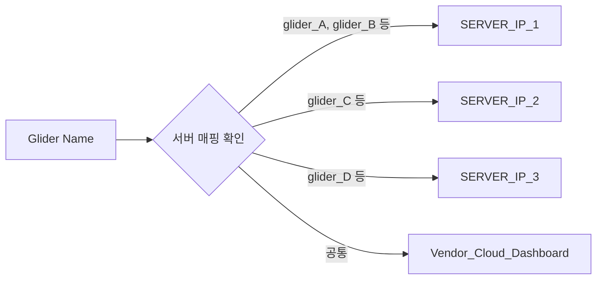
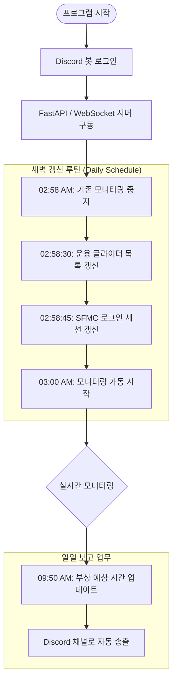
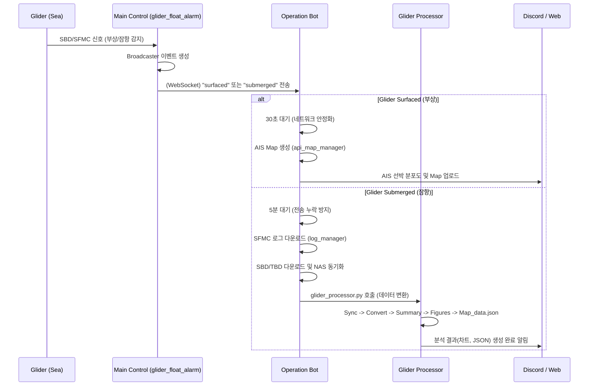
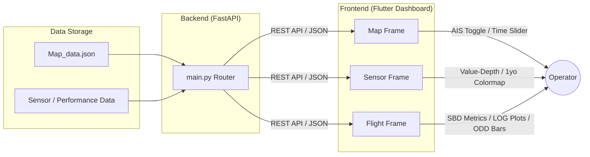

# 🌊 Integrated Glider Control System: Architecture Flow Chart

이 문서는 신규 개발자나 운영자가 시스템의 전체적인 흐름과 데이터 파이프라인을 쉽게 이해할 수 있도록 작성되었습니다. 각 서비스의 역할과 이벤트 기반의 자동화 로직을 시각화합니다.

---

## 0. 시작 전 준비 및 초기 설정 (Step 0: Initialization)

시스템을 새로운 서버에 배포하거나 초기 구동할 때 가장 먼저 확인해야 할 단계입니다. 글라이더가 어느 서버를 통해 데이터를 주고받는지 정의하고, 현재 운용 중인 글라이더 목록을 자동으로 생성합니다.

### A. 서버별 글라이더 배정 (`server_glider_list.py`)
이 파일은 글라이더 이름에 따라 접속해야 할 도킹 서버 IP를 매핑합니다.

### B. 운용 글라이더 리스트 자동 생성 (`list_glider_in_operation.py`)
SFMC 대시보드에 접속하여 현재 해역에서 운용 중(callbackPrimary 상태)인 글라이더만 골라내어 `use_glider.txt`를 생성합니다.

1.  **Playwright 구동**: Headless 브라우저로 SFMC 로그인.
2.  **Dashboard 스캔**: 모든 Deployment 항목 중 `callbackPrimary.xml` 상태인 글라이더 식별.
3.  **파일 저장**: 식별된 글라이더 이름을 `use_glider.txt`에 기록 (이후 모든 자동화 프로세스의 기준점이 됨).

---

## 1. 전제 시스템 조감도 (System Overview)

시스템은 크게 세 가지 레이어로 구성됩니다:
1.  **Main Control (`glider_float_alarm.py`)**: 시스템의 심장이자 이벤트 허브.
2.  **Operation Automation (`operation_bot_program.py`)**: 실시간 이벤트에 반응하여 데이터를 처리하는 자동화 엔진.
3.  **Visualization (`Web Control System`)**: 처리된 데이터를 시각화하여 관제자에게 제공하는 프론트엔드.

---

## 2. 주요 프로세스 흐름도 (Process Flow)

### A. 시스템 가동 및 스케줄링 (`glider_float_alarm.py`)
이 프로세스는 24시간 구동되며, 특정 시간마다 시스템의 상태를 갱신합니다.

### B. 이벤트 기반 자동화 파이프라인 (`operation_bot_program.py`)
글라이더의 상태(부상/잠항) 변화를 WebSocket으로 수신하여 즉시 대응합니다.

### C. 웹 관제 및 시각화 데이터 흐름 (Web/Flutter)
사용자가 브라우저를 통해 데이터를 조회하는 방식입니다.

---

## 3. 핵심 모듈별 상세 기능 명세 (Detailed Components)

### 1️⃣ glider_float_alarm.py (상위 관제)
-   **Discord Bot**: `!부예시` 명령어로 현재 모든 글라이더의 부상 예상 시간을 즉시 확인할 수 있습니다.
-   **WebSocket Hub**: `glider_connected_parsing.py`를 통해 장비의 커넥션 상태를 판별하고, 이를 WebSocket 및 Discord로 즉시 전파합니다.
-   **Wake Time Prediction**: 비행 주기를 분석하여 다음 부상 예상 시간을 산출하고 저장합니다.

### 2️⃣ operation_bot_program.py (운영 자동화)
-   **AIS Map Generator**: 부상 후 30초 뒤에 현재 위치 주변의 선박 데이터를 수집하여 관제용 지도를 자동 생성합니다.
-   **Glider Processor Logic**: 원본 파일(`*.log`, `*.dat`, `*.sbd`)을 가시화 가능한 `JSON` 및 `CSV` 파일로 가공하는 전체 파이프라인을 트리거합니다.
-   **Log Storage**: 다운로드된 로그를 특정 폴더로 이동시키고 NAS와 동기화하여 데이터 유실을 방지합니다.

### 3️⃣ Web Control System (Visualization)
-   **Map Visuals**: 글라이더의 과거 궤적(회색)과 현재 궤적을 구분하며, 슬라이더를 통해 시간대별 위치를 추적할 수 있습니다.
-   **Sensor Insights**: 
    -   **과거 vs 현재**: 과거 데이터는 회색(20m 간격), 현재 데이터는 컬러(1m 간격)로 표출됩니다.
    -   **Colormap 모드**: 최근 1년치 데이터를 수심과 시간 축으로 산점도(Scatter plot)를 그려 시계열적 변화를 보여줍니다.
-   **Flight Insights**:
    -   SBD 데이터를 기반으로 한 즉각적인 성능 지표(Glide Ratio, VMG 등).
    -   LOG 데이터를 기반으로 한 트렌드 차트(Voltage, Vacuum 등).
    -   ODD 등 에러 로그를 기반으로 한 세그먼트 막대 차트.

---

## 4. 신규 서버 배포 체크리스트 (New Deployment Checklist)

새로운 환경에서 시스템을 구동할 때 반드시 수정해야 할 파일과 항목입니다.

| 파일명 | 수정 항목 | 비고 |
| :--- | :--- | :--- |
| **`config.py`** | `BASE_DIR`, `DESKTOP_PATH` | 경로 설정 (운영 체제 및 유저 폴더 확인) |
| | `DISCORD_TOKEN_*` | 봇용 토큰 (Alarm, Operation 각각) |
| | `CHANNEL_ID_*` | 데이터를 송출할 채널 ID (총 4개 이상) |
| **`server_glider_list.py`** | `list_1`, `list_2`, `list_3` | 관리 대상 글라이더 명단 업데이트 |
| | `dockservers` | 각 도킹 서버별 실제 고정 IP 주소 |
| **`sfmc_login_logic.py`** | `CREDENTIALS` | 외부 연동 클라우드 웹사이트 접속을 위한 계정 정보 |

---

## 5. 새 구성원을 위한 가이드 (Newcomer Tips)
-   **Log Path**: 모든 원본 로그 및 처리된 데이터는 `config.py`에 정의된 `DESKTOP_PATH` 및 `BASE_DIR`을 기준으로 저장됩니다.
-   **Port Information**: 백엔드 API 및 WebSocket은 기본적으로 **8000번 포트**를 사용합니다.
-   **Troubleshooting**: 장비가 부상했는데 AIS 지도가 올라오지 않는다면 `operation_bot_program.py`의 로그와 Chrome WebDriver 상태를 먼저 확인하세요.
